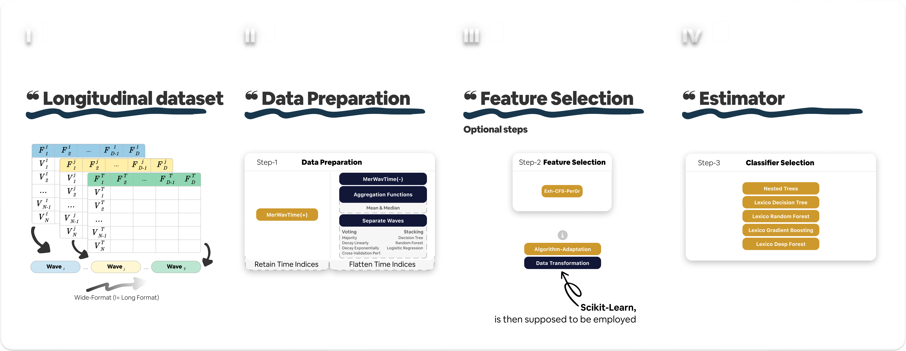

# Tutorials Overview :books:
# Tutorials Overview :books:

The following will guide you through the understanding of Scikit-Longitudinal (`Sklong`) through a series of tutorials.
We aim at offering an understanding first to what is a Longitudinal dataset per our definition, how do we generalise its temporal
dependencies, what shape (wide/long) do we expect your data to be in, and how to use the estimators and pipelines
available in `Sklong`.

<figure markdown="span" style="text-align: center;">
  { width="100%" loading="lazy" }
</figure>

_Click on the image to enlarge it._

The above figure illustrates the general flow of `Scikit-Longitudinal` from raw longitudinal data to the various primitives available.
As follows.

First, we would like to give you an overview of `Scikit-Longitudinal`, from raw longitudinal data to the various available
primitives. We begin by presenting the raw longitudinal (**wide-format**) data. We distinguish the temporal dependencies (
waves or time points) using colours (or focus the arrows). While the raw data simply requests that you provide data in a wide format, we then
demonstrate that you must prepare this data (via the `Data preparation` step). Using either a `data transformation` or `algorithm adaptation` approach. In a
nutshell, and we refer to the `JOSS` paper for more details, data transformation in blue / dark boxes will flatten the
temporal dependencies depending on what method you choose. Refer to the API reference for more information, but the idea
is that after such a transformation, you will have a dataset similar to a static tabular dataset. The resulting dataset
can then be used with any `Scikit-learn` compatible estimator. On the other hand, the `algorithm adaptation` will keep the
temporal dependencies in the dataset while restricting your routes to only `Scikit-Longitudinal` primitives, which are
fewer in number but more powerful in terms of temporal dependencies understanding during training. Once again, every primitive must be
explored in the API reference for more details.

Before all, recall that Scikit-Longitudinal is a library that extends the `Scikit-learn` ecosystem to handle longitudinal data.
That is, if you do not know about `Scikit-learn`, we recommend you first read the
[Scikit-learn documentation](https://scikit-learn.org/stable/user_guide.html) to understand the basics of how it works.

## :books: Overview of Tutorials

-   :fontawesome-solid-timeline:{ .lg .middle } __Temporal Dependency__

    ---

    Learn how to set up temporal dependencies using `features_group` and `non_longitudinal_features`. Essential for all
    `Sklong` usage.

    [:octicons-arrow-right-24: Read the tutorial](temporal_dependency.md)

-   :material-table:{ .lg .middle } __Longitudinal Data Format__

    ---

    Understand wide vs. long formats and why `Sklong` prefers wide. Includes loading and preparing data.

    [:octicons-arrow-right-24: Read the tutorial](sklong_longitudinal_data_format.md)

-   :bar_chart:{ .lg .middle } __Explore Your First Estimator__

    ---

    Fit and predict with a simple longitudinal estimator like `LexicoDecisionTreeClassifier`.

    [:octicons-arrow-right-24: Read the tutorial](sklong_explore_your_first_estimator.md)

-   :material-pipe:{ .lg .middle } __Explore Your First Pipeline__

    ---

    Build a full pipeline combining transformation, preprocessing, and estimation steps.

    [:octicons-arrow-right-24: Read the tutorial](sklong_explore_your_first_pipeline.md)

