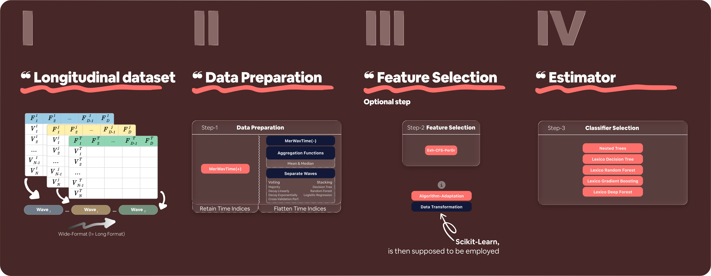

# Tutorials Overview

Welcome to the `Sklong` tutorials. This section walks through the core workflows, from representing longitudinal data to training estimators and building pipelines.
If you are new to the library, start with temporal dependencies and data format before moving into the applied tutorials.

In order to visualise what the library delivers, the figure below shows the high-level flow from raw longitudinal data to the main `Sklong` available to-pick components.

<figure class="expandable-media" markdown="span" style="text-align: center;">
 [{ width="100%" loading="lazy" }](../assets/images/Sklong_Doc_Banner.webp){ .expandable-media__trigger }

 <figcaption>Click the image to expand it.</figcaption>
</figure>

## List of Tutorials

<div class="grid cards" markdown>

- __Temporal Dependency__

    ---

    Learn how to set up temporal dependencies using `features_group` and `non_longitudinal_features`. Essential for all
    `Sklong` usage.

    [Read the tutorial](temporal_dependency.md)

- __Advanced Feature Group (Temporal) Setup__

    ---

    Handle uneven numbers of observations per subject, including missing waves and padded feature groups.

    [Read the tutorial](advanced_temporal_setup.md)

- __Longitudinal Data Format__

    ---

    Understand wide vs. long formats and why `Sklong` prefers wide. Includes loading and preparing data.

    [Read the tutorial](sklong_longitudinal_data_format.md)

- __Long ⇄ Wide Reshape__

    ---

    Pivot messy long-format cohorts into the wide layout `Sklong` expects (and back) using `LongitudinalDataset.to_wide` / `to_long`.

    [Read the tutorial](long_wide_reshape.md)

- __Data Preparation: Flatten Temporal Dependency for Scikit-Learn Estimators__

    ---

    Flatten longitudinal structure and plug it into standard estimators using transformations like `AggrFunc`.

    [Read the tutorial](sklong_data_preparation_first_exploration.md)

- __Algorithm Adaptation: Preserve Temporal Dependency for Sklong Estimators__

    ---

    Fit and predict with a longitudinal-aware estimator like `LexicoDecisionTreeClassifier`.

    [Read the tutorial](sklong_explore_your_first_estimator.md)

- __Binary vs. Multiclass Classification__

    ---

    Compare the same longitudinal workflow across binary and multiclass targets, including `predict_proba`,
    `classes_`, and AUPRC evaluation.

    [Read the tutorial](binary_vs_multiclass.md)

- __Pipelines: Mix Longitudinal Components__

    ---

    Build a full pipeline combining transformation, preprocessing, and estimation steps.

    [Read the tutorial](sklong_explore_your_first_pipeline.md)

- __Hyperparameter Tuning: Grid vs. Random Search__

    ---

    Compare grid search and random search for tuning `LexicoRandomForestClassifier` hyperparameters.

    [Read the tutorial](sklong_hyperparameter_tuning.md)

- __Automated Machine Learning (CASH)__

    ---

    Automate model selection and tuning across pipelines with Auto-Sklong.

    [Jump onto Auto-Sklong](https://github.com/simonprovost/Auto-Sklong)

</div>

<a id="dataset-used-in-tutorials"></a>

!!! tip "Dataset Used in Tutorials"
    All tutorials share the same synthetic health-inspired longitudinal dataset. Generate it once and reuse it across lessons:

    ```python
    import pandas as pd
    import numpy as np

    n_rows = 500
    columns = [
        'age', 'gender',
        'smoke_w1', 'smoke_w2',
        'cholesterol_w1', 'cholesterol_w2',
        'blood_pressure_w1', 'blood_pressure_w2',
        'diabetes_w1', 'diabetes_w2',
        'exercise_w1', 'exercise_w2',
        'obesity_w1', 'obesity_w2',
        'stroke_w2'
    ]

    data = []
    for _ in range(n_rows):
        row = {
            'age': np.random.randint(40, 71),
            'gender': np.random.choice([0, 1]),
        }
        for feature in ['smoke', 'cholesterol', 'blood_pressure', 'diabetes', 'exercise', 'obesity']:
            w1 = np.random.choice([0, 1], p=[0.7, 0.3])
            w2 = np.random.choice([0, 1], p=[0.2, 0.8]) if w1 == 1 else np.random.choice([0, 1], p=[0.9, 0.1])
            row[f'{feature}_w1'] = w1
            row[f'{feature}_w2'] = w2

        stroke_risk = row['smoke_w2'] == 1 or row['cholesterol_w2'] == 1 or row['blood_pressure_w2'] == 1
        p_stroke = 0.2 if stroke_risk else 0.05
        row['stroke_w2'] = np.random.choice([0, 1], p=[1 - p_stroke, p_stroke])
        data.append(row)

    df = pd.DataFrame(data)
    csv_file = './extended_stroke_longitudinal.csv'
    df.to_csv(csv_file, index=False)
    print(f"Extended CSV file '{csv_file}' created successfully.")
    ```

    | age | gender | smoke_w1 | smoke_w2 | cholesterol_w1 | cholesterol_w2 | blood_pressure_w1 | blood_pressure_w2 | diabetes_w1 | diabetes_w2 | exercise_w1 | exercise_w2 | obesity_w1 | obesity_w2 | stroke_w2 |
    |-----|--------|----------|----------|----------------|----------------|-------------------|-------------------|-------------|-------------|-------------|-------------|------------|------------|-----------|
    | 66 | 0 | 0 | 1 | 0 | 0 | 0 | 0 | 1 | 1 | 0 | 1 | 0 | 0 | 0 |
    | 59 | 0 | 0 | 0 | 1 | 1 | 0 | 0 | 1 | 1 | 1 | 1 | 1 | 1 | 1 |
    | 63 | 0 | 0 | 0 | 1 | 1 | 0 | 0 | 0 | 0 | 0 | 0 | 0 | 0 | 1 |
